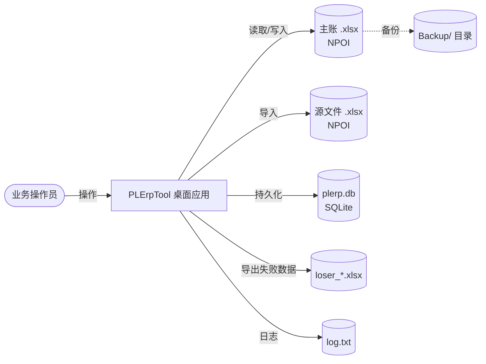
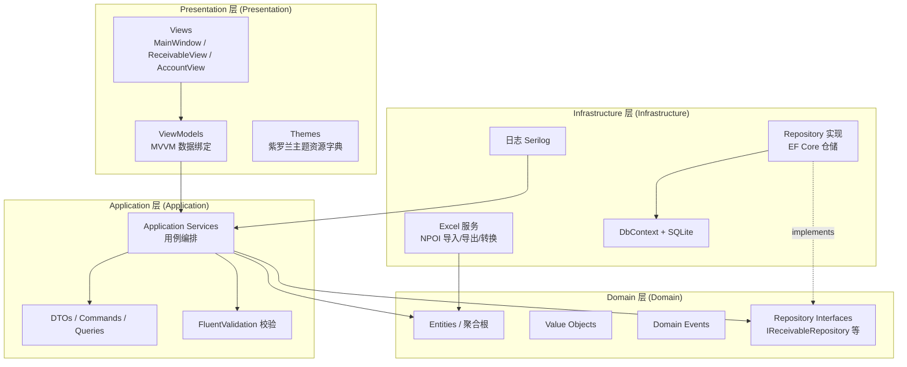
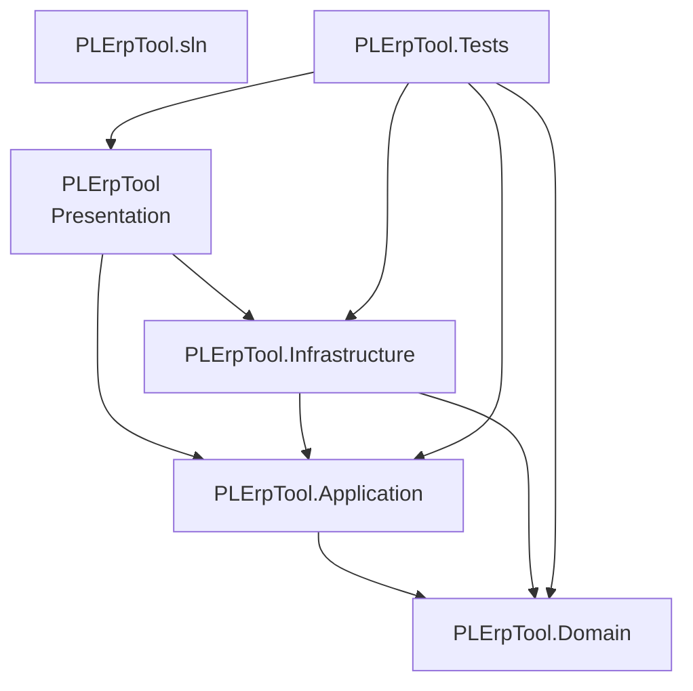

# Architecture Overview — PLErpTool (ERP 管理工具)

**Document Owner:** CTO — Dr. Kenji Nakamura (小T)
**Pipeline Stage:** 3 — UML Engineering Package
**Date:** 2026-08-08
**Status:** Draft — Pending User Approval

---

## 1. 系统上下文

PLErpTool 是一个面向五金行业账务的**桌面端 ERP 管理工具**，整合两个核心业务模块：

| 模块 | 来源 | 职责 |
|---|---|---|
| 应收管理 | HTML 原型 (`docs/gemini-code-1786199581879.html`) | 客户/业务员树状检索、月度欠款登记、收款登记、差额查询、Excel 导出 |
| 账套管理 | ExcelProject (`D:\LearningSoftWare\Vs Studio\Document\ExcelProject`) | 源文件导入、主账导入、按客户+业务员分 Sheet 转换、模板复制、公式/小计生成 |

**用户**为单机操作人员，无网络/多用户需求。

### 系统上下文图



---

## 2. 分层架构 (DDD 四层)

采用 **Domain-Driven Design 四层架构**，依赖方向**严格单向向内**：外层依赖内层，内层不依赖任何外层。



### 依赖规则（P1 治理约束）

| 规则 | 说明 | 违反后果 |
|---|---|---|
| Domain 层零外部依赖 | Domain 不引用 EF Core / NPOI / WPF / Serilog | P1 架构缺陷 |
| 依赖单向向内 | Presentation → Application → Domain；Infrastructure → Domain | P1 架构缺陷 |
| Repository 接口在 Domain | 实现在 Infrastructure（依赖倒置） | P1 架构缺陷 |
| ViewModel 不直连 Repository | 必须经 Application Service | P2 设计缺陷 |

---

## 3. UML 组件图

```mermaid
graph TB
    subgraph "PLErpTool 系统"
        subgraph Presentation
            MainWindow[MainWindow<br/>Shell 容器]
            ReceivableView[应收管理 View]
            AccountView[账套管理 View]
            MainMenu[主菜单组件]
        end

        subgraph Application
            ReceivableApp[ReceivableAppService<br/>应收用例]
            AccountApp[AccountAppService<br/>账套用例]
            ImportApp[ImportAppService<br/>导入用例]
        end

        subgraph Domain
            ReceivableDomain[应收领域<br/>Customer/Salesman/MonthlyDebt/Payment]
            AccountDomain[账套领域<br/>ImportRecord(内存)/MasterWorkbook/SheetSection]
            SharedKernel[Shared Kernel<br/>Money/DateRange]
            MasterDataSync[MasterDataSynchronizer<br/>客户/业务员同步]
        end

        subgraph Infrastructure
            ReceivableRepo[ReceivableRepository<br/>EF Core]
            ImportStore[InMemoryImportRecordStore<br/>内存缓存]
            ExcelService[ExcelService<br/>NPOI 转换]
            UnitOfWork[UnitOfWork<br/>EF Core DbContext]
            DbMigrator[数据库迁移<br/>EF Core Migrations]
        end
    end

    MainWindow --> MainMenu
    MainWindow --> ReceivableView
    MainWindow --> AccountView
    ReceivableView --> ReceivableApp
    AccountView --> AccountApp
    AccountView --> ImportApp
    ReceivableApp --> ReceivableDomain
    AccountApp --> AccountDomain
    ImportApp --> AccountDomain
    ReceivableApp --> AccountDomain
    AccountApp --> MasterDataSync
    MasterDataSync --> ReceivableDomain
    ReceivableRepo -.implements.-> ReceivableDomain
    ImportStore -.implements.-> AccountDomain
    ExcelService --> AccountDomain
    UnitOfWork --> DbMigrator
    ReceivableRepo --> UnitOfWork
    AccountApp --> ExcelService
    ImportApp --> ExcelService
    ImportApp --> ImportStore
    ReceivableDomain --> SharedKernel
    AccountDomain --> SharedKernel
```

---

## 4. 工程结构 (Solution 项目划分)

采用**四项目分层**，每个 DDD 层为独立 C# 项目，依赖关系由项目引用强制约束。



### 目录结构

```
PLErpTool/
├── PLErpTool.sln
├── docs/
│   ├── gemini-code-1786199581879.html      ← UI 原型
│   └── stage-3-architecture/               ← 本文档集
│
├── src/
│   ├── PLErpTool.Domain/                   ← 领域层（零外部依赖）
│   │   ├── PLErpTool.Domain.csproj
│   │   ├── Shared/
│   │   │   ├── Money.cs                     ← 值对象：金额
│   │   │   ├── DateRange.cs                 ← 值对象：账期范围
│   │   │   └── MonthKey.cs                  ← 值对象：月份键
│   │   ├── Receivable/
│   │   │   ├── Customer.cs                  ← 聚合根
│   │   │   ├── Salesman.cs                  ← 实体
│   │   │   ├── MonthlyDebt.cs               ← 聚合根
│   │   │   ├── Payment.cs                   ← 实体
│   │   │   ├── BalanceCalculator.cs        ← 领域服务
│   │   │   ├── MasterDataSynchronizer.cs   ← 领域服务（转换时同步客户/业务员）
│   │   │   ├── Events/
│   │   │   │   ├── PaymentRegistered.cs
│   │   │   │   └── DebtRecorded.cs
│   │   │   └── IReceivableRepository.cs     ← 仓储接口
│   │   └── Account/
│   │       ├── ImportRecord.cs             ← 内存缓存实体（不落库）
│   │       ├── MasterWorkbook.cs          ← 聚合根
│   │       ├── SheetSection.cs            ← 实体
│   │       ├── LedgerRow.cs               ← 实体
│   │       └── IImportRecordStore.cs       ← 内存缓存接口（非 EF 仓储）
│   │
│   ├── PLErpTool.Application/             ← 应用层
│   │   ├── PLErpTool.Application.csproj
│   │   ├── Receivable/
│   │   │   ├── Dtos/
│   │   │   │   ├── MonthlyDebtDto.cs
│   │   │   │   └── PaymentDto.cs
│   │   │   ├── Commands/
│   │   │   │   ├── RegisterPaymentCommand.cs
│   │   │   │   └── RecordDebtCommand.cs
│   │   │   ├── Queries/
│   │   │   │   └── QueryReceivablesQuery.cs
│   │   │   ├── Validators/
│   │   │   │   └── RegisterPaymentValidator.cs
│   │   │   └── ReceivableAppService.cs
│   │   └── Account/
│   │       ├── Dtos/
│   │       │   └── ImportResultDto.cs
│   │       ├── Commands/
│   │       │   ├── ImportSourceFilesCommand.cs
│   │       │   ├── ImportMasterWorkbookCommand.cs
│   │       │   └── ConvertToMasterCommand.cs
│   │       ├── Validators/
│   │       │   └── ConvertToMasterValidator.cs
│   │       └── AccountAppService.cs
│   │
│   ├── PLErpTool.Infrastructure/           ← 基础设施层
│   │   ├── PLErpTool.Infrastructure.csproj
│   │   ├── Persistence/
│   │   │   ├── PlErpDbContext.cs           ← EF Core DbContext（仅应收4表）
│   │   │   ├── Configurations/
│   │   │   │   ├── CustomerConfiguration.cs
│   │   │   │   ├── MonthlyDebtConfiguration.cs
│   │   │   │   └── PaymentConfiguration.cs
│   │   │   ├── Migrations/
│   │   │   └── Repositories/
│   │   │       └── ReceivableRepository.cs ← 实现 IReceivableRepository
│   │   ├── Import/
│   │   │   └── InMemoryImportRecordStore.cs ← 实现 IImportRecordStore（内存缓存）
│   │   ├── Excel/
│   │   │   ├── ExcelImportService.cs       ← NPOI 导入
│   │   │   ├── ExcelConvertService.cs     ← 账套转换 (迁移自 ExcelProject)
│   │   │   ├── ExcelExportService.cs      ← 导出失败数据
│   │   │   └── TemplateSheetBuilder.cs   ← 模板 Sheet 复制
│   │   ├── Logging/
│   │   │   └── SerilogConfigurator.cs
│   │   └── DependencyInjection/
│   │       └── ServiceCollectionExtensions.cs ← DI 注册扩展
│   │
│   └── PLErpTool/                          ← 表示层 (Presentation)
│       ├── PLErpTool.csproj
│       ├── App.xaml / App.xaml.cs          ← 组合根：DI 容器装配
│       ├── MainWindow.xaml / .cs           ← Shell 容器 + 模块切换
│       ├── Themes/
│       │   ├── VioletTheme.xaml            ← 紫罗兰主题资源字典
│       │   └── ControlTemplates.xaml       ← 表格/分页/弹窗控件模板
│       ├── Views/
│       │   ├── Receivable/
│       │   │   ├── ReceivableView.xaml      ← 应收管理界面
│       │   │   └── ReceivableView.xaml.cs
│       │   └── Account/
│       │       ├── AccountView.xaml         ← 账套管理界面
│       │       └── AccountView.xaml.cs
│       ├── ViewModels/
│       │   ├── MainViewModel.cs
│       │   ├── Receivable/
│       │   │   ├── ReceivableViewModel.cs
│       │   │   └── CustomerTreeViewModel.cs
│       │   └── Account/
│       │       ├── AccountViewModel.cs
│       │       └── ImportProgressViewModel.cs
│       └── Controls/
│           ├── PaginationControl.xaml       ← 分页组件
│           └── TerminalControl.xaml       ← 终端风格日志
│
└── tests/
    └── PLErpTool.Tests/
        ├── Domain/
        ├── Application/
        ├── Infrastructure/
        └── Excel/
```

---

## 5. 命名约定

| 类型 | 约定 | 示例 |
|---|---|---|
| 项目命名 | `PLErpTool.{Layer}` | `PLErpTool.Domain` |
| 命名空间 | `PLErpTool.{Layer}.{Module}.{Sub}` | `PLErpTool.Domain.Receivable` |
| 聚合根 | 名词单数，无后缀 | `MonthlyDebt` |
| 值对象 | 名词，不可变 | `Money`, `MonthKey` |
| 领域事件 | 过去式动词 + `DomainEvent` | `PaymentRegisteredDomainEvent` |
| 仓储接口 | `I{Aggregate}Repository` | `IReceivableRepository` |
| 应用服务 | `{Module}AppService` | `ReceivableAppService` |
| 命令 | 动词 + `Command` | `RegisterPaymentCommand` |
| 查询 | 名词 + `Query` | `QueryReceivablesQuery` |
| DTO | 名词 + `Dto` | `MonthlyDebtDto` |
| ViewModel | `{Screen}ViewModel` | `ReceivableViewModel` |
| View | `{Screen}View` | `ReceivableView` |

---

## 6. 主题规范 (紫罗兰主题)

从 HTML 原型提取的色值，固化到 `Themes/VioletTheme.xaml` 资源字典：

| 资源键 | 色值 | 用途 |
|---|---|---|
| `PrimaryBrush` | `#5448c8` | 主色（表头/按钮/激活态） |
| `PrimaryDarkBrush` | `#4237a0` | 悬停深色 |
| `MenuBackgroundBrush` | `#2c2c54` | 主菜单背景 |
| `SidebarBackgroundBrush` | `#faf9ff` | 侧栏背景 |
| `TableHeaderBackgroundBrush` | `#5448c8` | 表头背景 |
| `RowAltBackgroundBrush` | `#f7f6fc` | 表格斑马纹 |
| `RowHoverBrush` | `#f0effa` | 行悬停 |
| `NegativeBrush` | `#ff4d4f` | 负差额/欠款 |
| `PositiveBrush` | `#107c41` | 正差额/收款/导出 |
| `ExportButtonBrush` | `#107c41` | 导出按钮 |
| `DangerBrush` | `#ff4d4f` | 危险操作 |
| `BorderBrush` | `#e8e6f5` | 边框 |
| `TerminalBackgroundBrush` | `#1e1b2e` | 终端日志背景 |
| `TerminalForegroundBrush` | `#d4d4d4` | 终端日志文字 |

字体：`Microsoft YaHei`（微软雅黑）；终端：`Consolas`。

---

## 7. 与既有项目的关系

| 既有资产 | 复用方式 |
|---|---|
| ExcelProject `Form1.cs` 全部业务逻辑 | 迁移到 `Infrastructure/Excel/ExcelConvertService.cs`，剥离 WinForms UI 依赖，领域概念上提到 Domain 层 |
| ExcelProject 表头映射/去重/公式生成 | 保留核心算法，接口化便于测试 |
| HTML 原型 `sysLog()` 终端输出 | 映射为 `TerminalControl.xaml` + Serilog 控制台 sink |
| HTML 原型分页组件 `renderPagination()` | 映射为 `PaginationControl.xaml` 用户控件 |
| HTML 原型树状检索 `filterTree()` | 映射为 `CustomerTreeViewModel` |
| ExcelProject `loser_*.xlsx` 失败导出 | 复用为 `ExcelExportService.ExportFailedRecords()` |
| 真实 Excel 文件结构 | 见 `Excel-File-Analysis.md`——主账 443 Sheets（1 模板 + 442 客户对账单）、总账单 1 Sheet 扁平表，ExcelProject 逻辑完全兼容 |

---

## 8. 关键质量属性

| 属性 | 目标 | 验证手段 |
|---|---|---|
| 可测试性 | 领域层覆盖率 ≥75%；应用层 ≥60% | xUnit + EF Core in-memory |
| 可维护性 | 新增业务模块不动核心；3 个月内新成员可上手 | DDD 分层 + 命名约定 |
| 性能 | 应收查询 <200ms（万级）；账套转换 <30s/万行 | Stage 7 性能基准测试 |
| 可靠性 | 转换失败自动备份 + 失败数据导出 | 延续 ExcelProject 备份机制 |
| 数据完整性 | 重复数据去重；数量为 0 过滤；公式自动重算 | 仓储层 + Domain 校验 |

---

_本文档为 Stage 3 UML Engineering Package 的一部分，用户批准后与 TSD/ADR 一同锁定。_