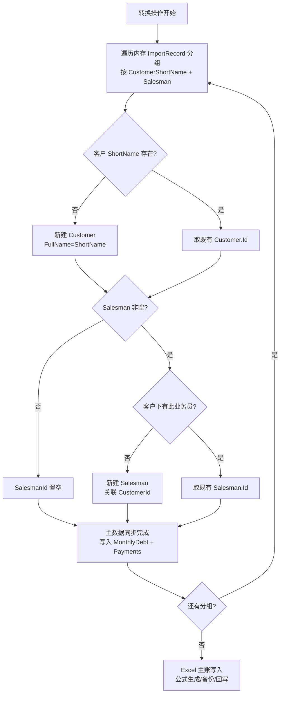
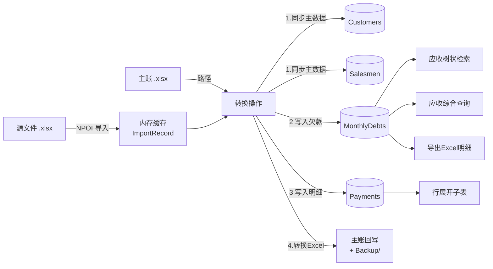

# Business Operations — PLErpTool (ERP 管理工具)

**Document Owner:** CTO — Dr. Kenji Nakamura (小T)
**Pipeline Stage:** 3 — UML Engineering Package
**Date:** 2026-08-08
**Status:** Draft — Pending User Approval
**Referenced Artifacts:** `Key-Flows.md`、`Domain-Model.md`、`ADR-005-data-import-boundary.md`

> 本文档以业务视角（非技术视角）梳理 PLErpTool 的核心操作，并明确每个操作的领域不变量与主数据同步规则。重点说明账套转换时的**客户/业务员主数据同步**机制。

---

## 1. 业务模块与核心操作总览

| 模块 | 操作 | 触发入口 | 主数据影响 | 关联流程 |
|---|---|---|---|---|
| 账套管理 | 导入源文件 | "导入文件"按钮 | 无（仅入内存缓存） | Key-Flows §1 |
| 账套管理 | 导入主账 | "导入主账"按钮 | 无（仅记录路径） | Key-Flows §1 变体 |
| 账套管理 | **转换** | "转换"按钮 | **✅ 同步客户+业务员** | Key-Flows §2 |
| 账套管理 | 重置导入数据 | "重置导入数据"按钮 | 无（清内存） | Key-Flows §8 |
| 应收管理 | 树状检索 | 点击客户树节点 | 读 | Key-Flows §3 |
| 应收管理 | 综合查询 | 工具栏"查询" | 读 | Key-Flows §4 |
| 应收管理 | 登记收款 | 行"收款"→弹窗 | 写 Payments + MonthlyDebt | Key-Flows §5 |
| 应收管理 | 新增月份欠款 | "＋新增月份欠款" | 写 MonthlyDebt | Key-Flows §6 |
| 应收管理 | 导出Excel明细 | "导出Excel明细" | 读 | Key-Flows §7 |

---

## 2. 主数据同步规则（核心）

### 2.1 客户主数据 (`Customers`)

| 规则 | 说明 |
|---|---|
| 同步时机 | 账套管理"转换"操作执行时 |
| 同步键 | `ShortName`（客户简称，唯一索引 `UX_Customers_ShortName`） |
| **无则新增** | 内存 `ImportRecord.CustomerShortName` 在 `Customers` 表中不存在 → 新建 `Customer` 记录 |
| **有则不新增** | `ShortName` 已存在 → 复用既有 `Customer.Id`，**不更新任何字段**（保持已有数据不变） |
| FullName 处理 | 新增时 `FullName = ShortName`（占位，后续可手动补全）；已存在时不改 |
| 事务 | 与转换写入在同一 `UnitOfWork` 事务内，失败回滚 |

### 2.2 业务员主数据 (`Salesmen`)

| 规则 | 说明 |
|---|---|
| 同步时机 | 账套管理"转换"操作执行时 |
| 同步键 | `(CustomerId, Name)`（客户下业务员唯一，`UX_Salesmen_Customer_Name`） |
| **无则新增** | 该客户下无此业务员名 → 新建 `Salesman` 记录，关联 `CustomerId` |
| **有则不新增** | 该客户下已存在同名业务员 → 复用既有 `Salesman.Id`，不更新 |
| 前置依赖 | 业务员必须归属客户——同步顺序：**先确保客户存在 → 再确保业务员存在** |
| 空业务员处理 | 若 `ImportRecord.Salesman` 为空字符串 → 跳过业务员同步，`MonthlyDebt.SalesmanId` 置 NULL 或 0（按实现约定） |

### 2.3 同步顺序与不变量



**领域不变量**：
- `Customer.ShortName` 全局唯一（DB 约束保证）
- `Salesman(CustomerId, Name)` 客户内唯一（DB 约束保证）
- 业务员必须归属已存在的客户（应用层校验，无物理外键）
- 同步操作幂等：多次转换同一批数据，客户/业务员不重复新增

---

## 3. 账套转换完整业务流程（含主数据同步）

这是本文档的核心——在 `Key-Flows.md §2` 基础上补充主数据同步环节。

### 3.1 前置条件

| 条件 | 校验点 |
|---|---|
| 内存缓存非空 | `InMemoryImportRecordStore.GetImportRecords().Count > 0` |
| 主账路径已设 | `masterWorkbookPath` 非空 |
| 无转换进行中 | `isConverting == false` |

### 3.2 执行步骤

| 步骤 | 操作 | 主数据影响 | 数据落点 |
|---|---|---|---|
| 1 | 从内存缓存取全部 `ImportRecord` | — | 内存 |
| 2 | 按 `(CustomerShortName, Salesman)` 分组 | — | 内存 |
| 3 | **主数据同步**（新增环节） | 客户/业务员 → `Customers`/`Salesmen` 表 | SQLite |
| 4 | 加载主账 Excel，构造 `MasterWorkbook` 聚合 | — | 内存 + 文件 |
| 5 | 按"客户+业务员"分组查找/创建 Sheet | — | Excel |
| 6 | 按月分组查找/创建月份分区，插入明细行 | — | Excel |
| 7 | 生成小计/合计/应收公式 | — | Excel |
| 8 | 重算公式，备份原文件，回写 | — | 文件系统 |
| 9 | 返回转换结果 + 备份路径 | — | UI |

### 3.3 步骤 3 详解：主数据同步（无则新增，有则不新增）

```
输入：List<ImportRecord>（来自内存缓存）
输出：同步 Customers + Salesmen 表，建立 ImportRecord → (CustomerId, SalesmanId) 映射

for each group (CustomerShortName, Salesman):
    customer = Customers.FindByShortName(CustomerShortName)
    if customer is null:
        customer = new Customer { ShortName = CustomerShortName, FullName = CustomerShortName }
        Customers.Add(customer)       // 新增
    else:
        // 有则不新增，复用 Id，不动任何字段

    if Salesman is not empty:
        salesman = Salesmen.FindByCustomerIdAndName(customer.Id, Salesman)
        if salesman is null:
            salesman = new Salesman { CustomerId = customer.Id, Name = Salesman }
            Salesmen.Add(salesman)     // 新增
        else:
            // 有则不新增，复用 Id
    else:
        salesman = null

    mapping[(CustomerShortName, Salesman)] = (customer.Id, salesman?.Id)
```

**幂等保证**：同一 `ShortName` 客户、同一 `(CustomerId, Name)` 业务员在事务内只新建一次；重复分组命中唯一索引，复用既有记录。

---

## 4. 应收管理操作业务说明

### 4.1 树状检索（读）

| 操作 | 数据来源 |
|---|---|
| 点击"全部" | `MonthlyDebts` 全表 + 关联 `Customers`/`Salesmen` 名称 |
| 点击公司节点 | `MonthlyDebts WHERE CustomerId = ?` |
| 点击业务员节点 | `MonthlyDebts WHERE CustomerId = ? AND SalesmanId = ?` |

> 客户树的数据来自 `Customers` + `Salesmen` 表——这些数据由账套转换时同步产生。若未执行过转换，树为空。

### 4.2 综合查询（读）

| 条件 | 实现 |
|---|---|
| 客户名 | `Customers.ShortName LIKE` |
| 业务员名 | `Salesmen.Name LIKE` |
| 账期范围 | `MonthlyDebts.Month >= start AND <= end`（Date 比较） |
| 当前差额为负 | `DebtAmount - CollectedAmount < 0`（表达式索引加速） |
| 分页 | `SKIP / LIMIT` |

### 4.3 登记收款（写）

| 步骤 | 操作 |
|---|---|
| 1 | 校验金额 > 0（FluentValidation + Domain `RecordPayment`） |
| 2 | 创建 `Payment`（类型=Collection），追加到 `MonthlyDebt.Payments` |
| 3 | 更新 `MonthlyDebt.CollectedAmount`（冗余列同步） |
| 4 | 发布 `PaymentRegisteredDomainEvent` |
| 5 | `UnitOfWork.SaveChanges` |

### 4.4 新增月份欠款（写）

| 步骤 | 操作 |
|---|---|
| 1 | 查找/创建 `MonthlyDebt`（客户+业务员+月份唯一约束） |
| 2 | 已存在 → 累加 `DebtAmount`；不存在 → 新建 |
| 3 | 发布 `DebtRecordedDomainEvent` |
| 4 | SaveChanges |

### 4.5 导出Excel明细（读+写文件）

| 步骤 | 操作 |
|---|---|
| 1 | 按当前查询条件取 `MonthlyDebt` 列表 |
| 2 | NPOI 创建 Workbook，写表头+数据行 |
| 3 | 输出 `.xlsx` 文件 |

---

## 5. 数据流转全景



---

## 6. 边界情况与决策

| 情况 | 处理 |
|---|---|
| 同一客户简称大小写不同（"张三公司" vs "张三公司 "） | 导入前 `NormalizeSheetPart`（去空格），匹配时 `StringComparer.OrdinalIgnoreCase` |
| 业务员名在不同客户下重复（"李四"属多个公司） | 允许——`UX_Salesmen_Customer_Name` 是 `(CustomerId, Name)` 复合唯一，不同客户下可重名 |
| 转换中途失败 | 事务回滚，客户/业务员新建也回滚；Excel 已备份可恢复 |
| 内存缓存中同一客户有多个业务员 | 分组后逐组处理，客户只在首次遇到时新建 |
| `Salesman` 为空 | 跳过业务员同步，欠款记录 `SalesmanId` 置空 |
| 客户已存在但想更新 `FullName` | 转换不更新——有则不新增；后续可加独立"客户维护"操作（当前范围外） |

---

## 7. 与 ADR-005 的关系

本同步规则是 ADR-005（应收数据导入边界）的**细化**：

- ADR-005 确立"ImportRecord → MonthlyDebt 转换"边界
- 本文档明确转换时的**主数据同步**作为转换的前置子步骤
- 同步策略：**无则新增，有则不新增**（幂等同步，不覆盖既有数据）

---

_本文档为 Stage 3 UML Engineering Package 的业务操作梳理，用户批准后锁定。Stage 5 实现的转换流程必须包含主数据同步步骤，遗漏为 P1 缺陷。_

---

**Drafted by:** CTO — Dr. Kenji Nakamura (小T)
**Locked at Stage 3 gate approval — not revisable in Stage 4+.**