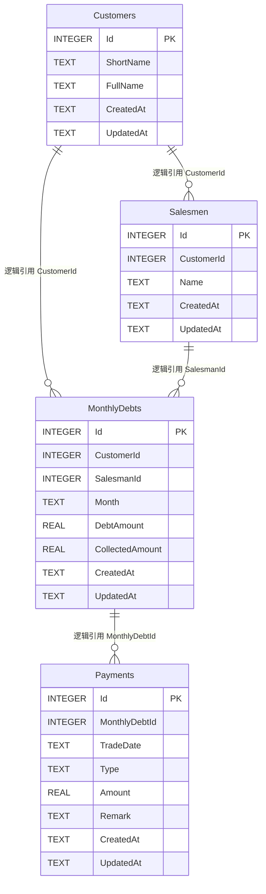

# Database Schema — PLErpTool (ERP 管理工具)

**Document Owner:** VP Data / Head of Analytics — Dr. Hana Sato (小库)
**Pipeline Stage:** 3 — UML Engineering Package (持久化层映射)
**Date:** 2026-08-08
**Status:** Draft — Pending User Approval (v2 — 应用用户调整)
**Referenced Artifacts:** `Domain-Model.md`、`ADR-002-persistence-sqlite-efcore.md`、`ADR-005-data-import-boundary.md`、`Deployment.md` §3.1

> **v2 变更摘要（相对 v1）：**
> 1. 所有表的创建/修改时间统一为 **无时区 timestamp**（SQLite `TEXT` ISO8601 本地时间，不加 `Z`/偏移）
> 2. `MonthlyDebts.Month` 由 `TEXT(yyyy-MM)` 改为 **`Date` 类型**（SQLite 以 `TEXT` 存 `yyyy-MM-dd`，统一取月首日；C# 侧映射为 `DateTime`）
> 3. **所有表移除外键约束**（取消 `FOREIGN KEY` 与 `ON DELETE` 策略，引用完整性由应用层/领域层保证）
> 4. **移除导入记录缓存表**：`ImportRecords` 与 `ImportFiles` 不落库，导入数据临时存内存（详见 ADR-005 v2）

---

## 1. 设计原则

| 原则 | 说明 |
|---|---|
| 聚合根 = 聚合表 | 每个聚合根对应一张表，聚合内实体作为子表通过逻辑引用列关联 |
| 无物理外键 | 所有表不建 `FOREIGN KEY`；引用完整性由应用层（查存在性）与领域层（聚合不变量）保证 |
| 时间戳无时区 | `CreatedAt`/`UpdatedAt` 统一 `TEXT` 存本地 ISO8601 `yyyy-MM-dd HH:mm:ss`，**不带时区标识**（无 `Z`、无 `+08:00`） |
| 月份用 Date | `MonthlyDebts.Month` 用 `Date` 语义，存储 `yyyy-MM-01`（月首日），C# 映射 `DateTime`，查询按月比较 |
| 索引按查询模式 | 按 `Key-Flows.md` 查询路径建索引（客户树、按月过滤、差额为负） |
| 金额存 `REAL` | SQLite 无原生 decimal，金额用 `REAL`（double），精度由应用层 `Money` 值对象保证 |
| 导入记录不入库 | `ImportRecord` 为内存临时缓存实体，随会话生命周期，重置即清空（详见 ADR-005 v2） |

### 无物理外键的取舍（小库 + 小T 联合说明）

| 角度 | 说明 |
|---|---|
| 为何去外键 | SQLite 外键需 `PRAGMA foreign_keys=ON`（连接级，易遗漏）；单机单用户无并发写入冲突；聚合一致性由领域层保证（`RecordPayment`、`Convert` 等方法内校验）；减少迁移与级联复杂度 |
| 完整性兜底 | 应用层在写入子表前校验父表记录存在；聚合根删除前校验无子引用（`RESTRICT` 语义在应用层实现）；导入转换在同一 `UnitOfWork` 事务内完成 |
| CIO 安全视角 | 无外键不降低安全（无网络传输、本地存储）；完整性风险可控，由领域不变量 + 事务保证 |

---

## 2. 表清单

| # | 表名 | 对应领域 | 聚合根 | 落库 |
|---|---|---|---|---|
| 1 | `Customers` | Customer | ✅ 聚合根 | 是 |
| 2 | `Salesmen` | Salesman（Customer 聚合内实体） | — | 是 |
| 3 | `MonthlyDebts` | MonthlyDebt | ✅ 聚合根 | 是 |
| 4 | `Payments` | Payment（MonthlyDebt 聚合内实体） | — | 是 |

> ~~`ImportRecords`~~ / ~~`ImportFiles`~~ 已移除——导入数据为内存临时缓存，不入库（ADR-005 v2）。

---

## 3. ER 关系图（逻辑关系，无物理外键）



> ER 图中的连线表示**逻辑引用关系**，无物理外键约束。

---

## 4. 表定义 (SQLite DDL)

### 4.1 `Customers` — 客户表

```sql
CREATE TABLE Customers (
    Id          INTEGER PRIMARY KEY AUTOINCREMENT,
    ShortName   TEXT    NOT NULL,
    FullName    TEXT    NULL,
    CreatedAt   TEXT    NOT NULL DEFAULT (strftime('%Y-%m-%d %H:%M:%S','now','localtime')),
    UpdatedAt   TEXT    NOT NULL DEFAULT (strftime('%Y-%m-%d %H:%M:%S','now','localtime'))
);

CREATE UNIQUE INDEX UX_Customers_ShortName ON Customers (ShortName);
```

| 列 | 类型 | 约束 | 领域映射 |
|---|---|---|---|
| `Id` | INTEGER | PK, AUTOINCREMENT | `Customer.CustomerId` |
| `ShortName` | TEXT | NOT NULL, UNIQUE | `Customer.ShortName`（客户简称，去重键） |
| `FullName` | TEXT | NULL | `Customer.FullName` |
| `CreatedAt` | TEXT | NOT NULL | 审计（无时区 timestamp） |
| `UpdatedAt` | TEXT | NOT NULL | 审计（无时区 timestamp） |

> **时间格式**：`yyyy-MM-dd HH:mm:ss` 本地时间，不带 `Z` / `+08:00`。
> **`UpdatedAt` 维护**：EF Core `SaveChanges` 时由应用层/拦截器统一刷新。

### 4.2 `Salesmen` — 业务员表

```sql
CREATE TABLE Salesmen (
    Id          INTEGER PRIMARY KEY AUTOINCREMENT,
    CustomerId  INTEGER NOT NULL,
    Name        TEXT    NOT NULL,
    CreatedAt   TEXT    NOT NULL DEFAULT (strftime('%Y-%m-%d %H:%M:%S','now','localtime')),
    UpdatedAt   TEXT    NOT NULL DEFAULT (strftime('%Y-%m-%d %H:%M:%S','now','localtime'))
);

CREATE UNIQUE INDEX UX_Salesmen_Customer_Name ON Salesmen (CustomerId, Name);
```

| 列 | 类型 | 约束 | 领域映射 |
|---|---|---|---|
| `Id` | INTEGER | PK, AUTOINCREMENT | `Salesman.SalesmanId` |
| `CustomerId` | INTEGER | NOT NULL | 逻辑引用 `Customers.Id`（**无物理外键**） |
| `Name` | TEXT | NOT NULL | `Salesman.Name` |
| `CreatedAt` | TEXT | NOT NULL | 无时区 timestamp |
| `UpdatedAt` | TEXT | NOT NULL | 无时区 timestamp |

> **引用完整性**：应用层写入前校验 `CustomerId` 在 `Customers` 存在；删除客户前校验无关联业务员（`RESTRICT` 语义在应用层实现）。

### 4.3 `MonthlyDebts` — 月度欠款表（聚合根）

```sql
CREATE TABLE MonthlyDebts (
    Id              INTEGER PRIMARY KEY AUTOINCREMENT,
    CustomerId      INTEGER NOT NULL,
    SalesmanId      INTEGER NOT NULL,
    Month           TEXT    NOT NULL,
    DebtAmount      REAL    NOT NULL DEFAULT 0,
    CollectedAmount REAL    NOT NULL DEFAULT 0,
    CreatedAt       TEXT    NOT NULL DEFAULT (strftime('%Y-%m-%d %H:%M:%S','now','localtime')),
    UpdatedAt       TEXT    NOT NULL DEFAULT (strftime('%Y-%m-%d %H:%M:%S','now','localtime'))
);

CREATE UNIQUE INDEX UX_MonthlyDebts_Cust_Salesman_Month ON MonthlyDebts (CustomerId, SalesmanId, Month);
CREATE INDEX IX_MonthlyDebts_Customer    ON MonthlyDebts (CustomerId);
CREATE INDEX IX_MonthlyDebts_Salesman    ON MonthlyDebts (SalesmanId);
CREATE INDEX IX_MonthlyDebts_Month       ON MonthlyDebts (Month);
CREATE INDEX IX_MonthlyDebts_Balance_Neg ON MonthlyDebts ((DebtAmount - CollectedAmount) < 0);
```

| 列 | 类型 | 约束 | 领域映射 |
|---|---|---|---|
| `Id` | INTEGER | PK, AUTOINCREMENT | `MonthlyDebt.MonthlyDebtId` |
| `CustomerId` | INTEGER | NOT NULL | 逻辑引用 `Customers.Id`（无物理外键） |
| `SalesmanId` | INTEGER | NOT NULL | 逻辑引用 `Salesmen.Id`（无物理外键） |
| `Month` | TEXT (Date) | NOT NULL (`yyyy-MM-01`) | `MonthlyDebt.Month`（**Date 类型**，存月首日） |
| `DebtAmount` | REAL | NOT NULL, default 0 | `MonthlyDebt.DebtAmount` (`Money`) |
| `CollectedAmount` | REAL | NOT NULL, default 0 | `MonthlyDebt.CollectedAmount`（派生：Σ Collection Payments） |
| `CreatedAt` | TEXT | NOT NULL | 无时区 timestamp |
| `UpdatedAt` | TEXT | NOT NULL | 无时区 timestamp |

> **Month 改为 Date（v2）**：存储 `yyyy-MM-01`（月首日），C# 映射 `DateTime`（`Kind=Unspecified`）。查询按月比较时用 `>= 月首 AND < 次月首` 或 `strftime('%Y-%m', Month) = 'yyyy-MM'`。MonthKey 值对象与 Date 互转：`MonthKey.Value("yyyy-MM")` ↔ `new DateTime(year, month, 1)`。
>
> **唯一约束**：`UX_MonthlyDebts_Cust_Salesman_Month` 保证同一客户+业务员+月份唯一，支撑 ADR-005 的"已存在则累加"策略。
>
> **派生列 `CollectedAmount`**：冗余列，由 `Payments` 聚合维护（收款登记时同步更新），避免每次查询 SUM。差额 = `DebtAmount - CollectedAmount`。
>
> **"当前差额为负"索引**：`IX_MonthlyDebts_Balance_Neg` 为表达式索引（SQLite 3.8+），加速 HTML 原型"当前差额为负"复选框过滤。
>
> **引用完整性**：应用层写入前校验 `CustomerId`/`SalesmanId` 存在；删除客户/业务员前校验无关联欠款（`RESTRICT` 语义在应用层）。

### 4.4 `Payments` — 收款/欠款明细表

```sql
CREATE TABLE Payments (
    Id              INTEGER PRIMARY KEY AUTOINCREMENT,
    MonthlyDebtId   INTEGER NOT NULL,
    TradeDate       TEXT    NOT NULL,
    Type            TEXT    NOT NULL CHECK (Type IN ('Debt', 'Collection')),
    Amount          REAL    NOT NULL CHECK (Amount >= 0),
    Remark          TEXT    NULL,
    CreatedAt       TEXT    NOT NULL DEFAULT (strftime('%Y-%m-%d %H:%M:%S','now','localtime')),
    UpdatedAt       TEXT    NOT NULL DEFAULT (strftime('%Y-%m-%d %H:%M:%S','now','localtime'))
);

CREATE INDEX IX_Payments_MonthlyDebt ON Payments (MonthlyDebtId);
CREATE INDEX IX_Payments_Type       ON Payments (Type);
```

| 列 | 类型 | 约束 | 领域映射 |
|---|---|---|---|
| `Id` | INTEGER | PK, AUTOINCREMENT | `Payment.PaymentId` |
| `MonthlyDebtId` | INTEGER | NOT NULL | 逻辑引用 `MonthlyDebts.Id`（无物理外键） |
| `TradeDate` | TEXT | NOT NULL (`yyyy-MM-dd`) | `Payment.TradeDate` |
| `Type` | TEXT | NOT NULL, CHECK ∈ {Debt, Collection} | `Payment.PaymentType` 枚举 |
| `Amount` | REAL | NOT NULL, CHECK ≥ 0 | `Payment.Amount` (`Money`) |
| `Remark` | TEXT | NULL | `Payment.Remark` |
| `CreatedAt` | TEXT | NOT NULL | 无时区 timestamp |
| `UpdatedAt` | TEXT | NOT NULL | 无时区 timestamp |

> **CHECK 约束保留**：`Type` 枚举与 `Amount ≥ 0` 仍由 DB 兜底（非外键，属值域约束）。
> **级联删除在应用层**：删除 `MonthlyDebt` 时应用层先删 `Payments`（聚合一致性），无 DB 级 `CASCADE`。

---

## 5. 索引策略与查询映射

| 索引 | 支撑查询 | 来源流程 |
|---|---|---|
| `UX_Customers_ShortName` | 导入时查找/创建客户 | ADR-005 |
| `UX_Salesmen_Customer_Name` | 导入时查找/创建业务员 | ADR-005 |
| `UX_MonthlyDebts_Cust_Salesman_Month` | 唯一约束 + 按节点加载 | Key-Flows §3 |
| `IX_MonthlyDebts_Customer` | 按公司加载欠款 | Key-Flows §3 (`loadCompanyData`) |
| `IX_MonthlyDebts_Salesman` | 按业务员加载欠款 | Key-Flows §3 (`loadData`) |
| `IX_MonthlyDebts_Month` | 账期范围过滤（Date 比较） | Key-Flows §4 (`searchData`) |
| `IX_MonthlyDebts_Balance_Neg` | "当前差额为负"复选框过滤 | Key-Flows §4 |
| `IX_Payments_MonthlyDebt` | 展开行子表加载 | Key-Flows §3 (HTML `toggleDetails`) |
| `IX_Payments_Type` | 按类型筛选明细 | Key-Flows §3 |

> ~~导入缓存相关索引全部移除~~（`ImportRecords`/`ImportFiles` 不落库）。

---

## 6. EF Core 8 实体配置约定

所有配置位于 `PLErpTool.Infrastructure/Persistence/Configurations/`，使用 **Fluent API**（领域层无 EF 特性，保持纯净）。

### 6.1 配置约定

| 项 | 约定 |
|---|---|
| 主键 | `Id` → `ValueGeneratedOnAdd()`，类型 `long`（SQLite INTEGER） |
| 金额列 | `HasColumnType("REAL")`，C# `decimal`（应用层精度保证） |
| 时间戳列 | `HasColumnType("TEXT")`，C# `DateTime`（`Kind=Unspecified`，无时区）；`CreatedAt` 默认 `DateTime.Now`，`UpdatedAt` 由 `SaveChanges` 拦截器刷新 |
| 月份列 | `Month` → `HasColumnType("TEXT")` + 值转换 `MonthKey ↔ DateTime(月首日)` |
| 关系 | **不配置物理外键**：`HasOne/HasMany` 仅配导航，`HasForeignKey` 指定引用列但 `.OnDelete(DeleteBehavior.NoAction)`；完整性靠应用层 |
| 级联 | 无 DB 级联；应用层显式删除子表 |
| 值对象 | `Money` 用 `OwnsOne` 转换为 `REAL`；`MonthKey` 用值转换器 |

### 6.2 示例：`MonthlyDebtConfiguration`

```csharp
public class MonthlyDebtConfiguration : IEntityTypeConfiguration<MonthlyDebt>
{
    public void Configure(EntityTypeBuilder<MonthlyDebt> builder)
    {
        builder.ToTable("MonthlyDebts");
        builder.HasKey(x => x.Id);
        builder.Property(x => x.Id).ValueGeneratedOnAdd();

        // Month: Date 类型，存月首日 yyyy-MM-01，无时区
        builder.Property(x => x.Month)
               .HasConversion(
                   m => new DateTime(m.Year, m.Month, 1),          // MonthKey -> DateTime
                   v => MonthKey.FromDateTime(v))                  // DateTime -> MonthKey
               .HasColumnType("TEXT");

        builder.Property(x => x.DebtAmount)
               .HasConversion(m => m.Value, v => new Money(v))
               .HasColumnType("REAL");

        builder.Property(x => x.CollectedAmount)
               .HasConversion(m => m.Value, v => new Money(v))
               .HasColumnType("REAL");

        // 时间戳无时区
        builder.Property(x => x.CreatedAt).HasColumnType("TEXT");
        builder.Property(x => x.UpdatedAt).HasColumnType("TEXT");

        // 关系：仅导航，无物理外键
        builder.HasOne<Customer>().WithMany()
               .HasForeignKey(x => x.CustomerId)
               .OnDelete(DeleteBehavior.NoAction);   // 无 DB 级联

        builder.HasOne<Salesman>().WithMany()
               .HasForeignKey(x => x.SalesmanId)
               .OnDelete(DeleteBehavior.NoAction);

        builder.HasMany(x => x.Payments)
               .WithOne()
               .HasForeignKey(p => p.MonthlyDebtId)
               .OnDelete(DeleteBehavior.NoAction);   // 应用层级联

        builder.HasIndex(x => new { x.CustomerId, x.SalesmanId, x.Month })
               .IsUnique()
               .HasDatabaseName("UX_MonthlyDebts_Cust_Salesman_Month");

        builder.HasIndex(x => x.CustomerId).HasDatabaseName("IX_MonthlyDebts_Customer");
        builder.HasIndex(x => x.SalesmanId).HasDatabaseName("IX_MonthlyDebts_Salesman");
        builder.HasIndex(x => x.Month).HasDatabaseName("IX_MonthlyDebts_Month");

        builder.Ignore(x => x.Balance);   // 派生属性，不映射
    }
}
```

### 6.3 DbContext 约定

```csharp
public class PlErpDbContext : DbContext
{
    public DbSet<Customer> Customers => Set<Customer>();
    public DbSet<Salesman> Salesmen => Set<Salesman>();
    public DbSet<MonthlyDebt> MonthlyDebts => Set<MonthlyDebt>();
    public DbSet<Payment> Payments => Set<Payment>();

    // 注：ImportRecord/ImportFile 不注册 DbSet（内存缓存，不入库）

    protected override void OnConfiguring(DbContextOptionsBuilder options)
    {
        options.UseSqlite("Data Source=plerp.db");
        options.UseQueryTrackingBehavior(QueryTrackingBehavior.NoTrackingWithIdentityResolution);
    }

    protected override void OnModelCreating(ModelBuilder modelBuilder)
    {
        modelBuilder.ApplyConfigurationsFromAssembly(typeof(PlErpDbContext).Assembly);
        // 不启用 PRAGMA foreign_keys（无物理外键）
    }
}
```

> **不再执行 `PRAGMA foreign_keys=ON`**——因无物理外键，无需开启。

---

## 7. 迁移与初始化

| 项 | 说明 |
|---|---|
| 迁移工具 | `dotnet ef migrations add Init` |
| 应用方式 | 启动时 `DbMigrator.EnsureMigrated()`（`Database.Migrate()`） |
| 外键启用 | **不需要**（无物理外键） |
| 种子数据 | 无强制种子；客户/业务员由导入时按需创建 |
| 回滚 | EF Core 迁移 `migrations remove` / `database update <prev>` |
| 时间戳拦截 | 注册 `SaveChanges` 拦截器统一刷新 `UpdatedAt` |

### 时间戳拦截器示例

```csharp
public class TimestampInterceptor : SaveChangesInterceptor
{
    public override ValueTask<InterceptionResult<int>> SavingChangesAsync(
        DbContextEventData eventData, InterceptionResult<int> result, CancellationToken ct = default)
    {
        var now = DateTime.Now;   // 无时区，本地时间
        foreach (var entry in eventData.Context!.ChangeTracker.Entries())
        {
            if (entry.State == EntityState.Added && entry.Metadata.FindProperty("CreatedAt") is not null)
                entry.Property("CreatedAt").CurrentValue = now;

            if (entry.State == EntityState.Modified && entry.Metadata.FindProperty("UpdatedAt") is not null)
                entry.Property("UpdatedAt").CurrentValue = now;
        }
        return base.SavingChangesAsync(eventData, result, ct);
    }
}
```

---

## 8. 数据完整性规则汇总

| 规则 | 实现层 | 说明 |
|---|---|---|
| 客户简称唯一 | DB (`UX_Customers_ShortName`) + 应用层查找或创建 | 导入去重 |
| 业务员同客户下唯一 | DB (`UX_Salesmen_Customer_Name`) + 应用层 | 导入去重 |
| 月度欠款唯一 | DB (`UX_MonthlyDebts_Cust_Salesman_Month`) | 同客户+业务员+月不重复 |
| 收款金额非负 | DB (`CHECK Amount >= 0`) + Domain (`RecordPayment` 校验 > 0) | 双重保障 |
| 收款类型枚举 | DB (`CHECK Type IN ('Debt','Collection')`) + Domain (`PaymentType` 枚举) | 双重保障 |
| 父子引用完整性 | **应用层**（无物理外键）：写子表前查父表存在；删父表前查无子引用 | 替代 DB 外键 |
| 删除聚合级联 | **应用层**：删 `MonthlyDebt` 前先删 `Payments` | 替代 DB `CASCADE` |
| 时间戳无时区 | DB `TEXT` ISO8601 本地时间 + EF 拦截器 `DateTime.Now` | 统一无时区 |
| 月份 Date 语义 | DB `TEXT yyyy-MM-01` + 值转换 `MonthKey ↔ DateTime(月首日)` | Date 类型 |

> ~~导入记录去重~~（移除）：`ImportRecord` 不落库，去重在内存层用 `HashSet<UniqueKey>` 实现（复用 ExcelProject `importedRecordKeys`）。

---

## 9. 导入记录的内存缓存设计（替代落库）

由于 `ImportRecords`/`ImportFiles` 不再入库，导入数据以**内存临时缓存**形式存在于应用层/基础设施层，生命周期为会话级：

| 项 | 说明 |
|---|---|
| 缓存载体 | `InMemoryImportRecordStore`（基础设施层，注入为 Singleton 或 Scoped） |
| 数据结构 | `List<ImportRecord>` + `HashSet<string> UniqueKeys`（去重）+ `HashSet<string> FileNames`（文件名去重） |
| 生命周期 | 应用启动→应用关闭；重置按钮清空（复用 ExcelProject `ResetBtn_Click`） |
| 持久化 | 无；关闭程序即丢失（符合"临时缓存"定位） |
| 消费 | 账套转换/应收导入时从内存读取，转换后写入 `MonthlyDebts` 等落库表 |
| 线程安全 | 单机单用户，无需锁；如后续多窗口操作，加 `lock` 或 `ConcurrentBag` |

> 详见 ADR-005 v2 的导入边界与内存缓存策略。

---

## 10. 与既有 ExcelProject 概念的映射（v2）

| ExcelProject 内存结构 | PLErpTool 处理（v2） | 变化 |
|---|---|---|
| `importedFileNames` (HashSet) | `InMemoryImportRecordStore.FileNames` | 保持内存，不入库 |
| `importedRecords` (List) | `InMemoryImportRecordStore.Records` | 保持内存，不入库 |
| `importedRecordKeys` (HashSet) | `InMemoryImportRecordStore.UniqueKeys` | 保持内存 |
| `masterWorkbookPath` (string) | 应用层状态（不入库） | 不变 |
| `allReceivableData` (HTML 原型模拟) | `MonthlyDebts` + `Payments` 表 | 落库（不变） |

---

_本文档为 Stage 3 UML Engineering Package 的持久化层映射（v2），用户批准后与 ADR-002/ADR-005 一同锁定。Stage 5 实现的 EF Core 配置必须与本表结构严格一致，偏差为 P1 缺陷。_

---

**Drafted by:** VP Data / Head of Analytics — Dr. Hana Sato (小库)
**Reviewed by:** CTO — Dr. Kenji Nakamura (小T) — 确认架构一致性
**Locked at Stage 3 gate approval — not revisable in Stage 4+.**