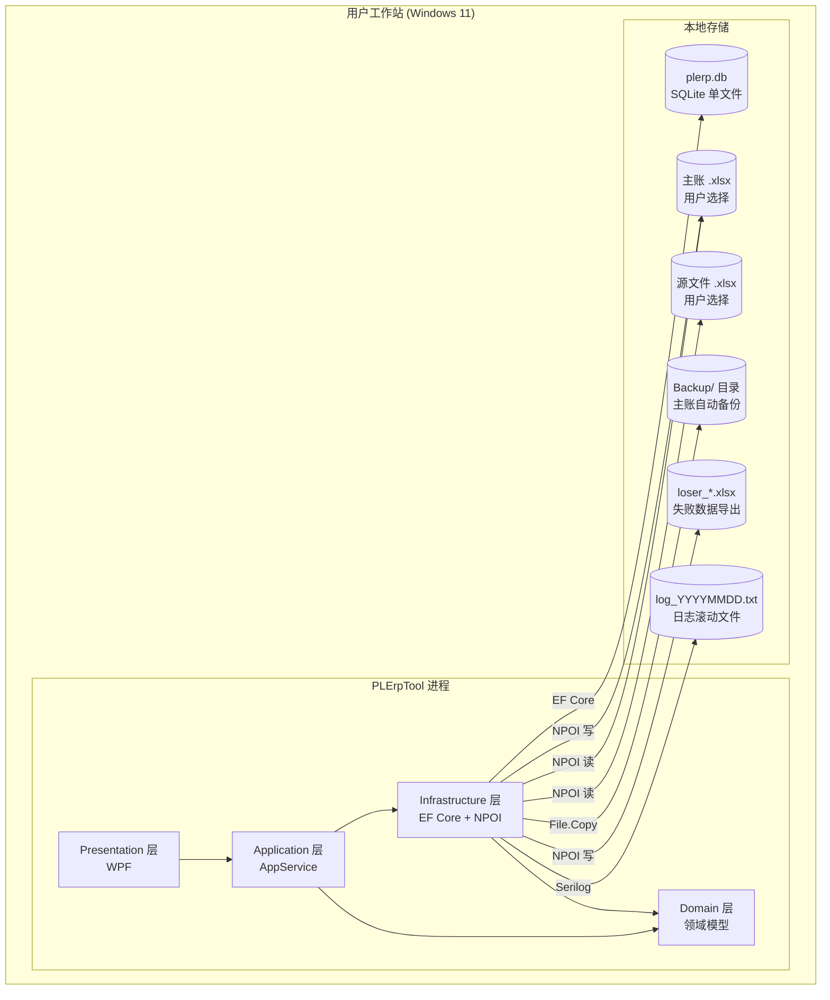

# Deployment — PLErpTool (ERP 管理工具)

**Document Owner:** CTO — Dr. Kenji Nakamura (小T)
**Pipeline Stage:** 3 — UML Engineering Package
**Date:** 2026-08-08
**Status:** Draft — Pending User Approval

---

## 1. UML 部署图

PLErpTool 为**单机桌面应用**，全部组件部署在用户工作站，无服务器、无网络依赖。

---

## 2. 运行环境

| 项 | 规格 |
|---|---|
| 操作系统 | Windows 10/11 (x64) |
| 运行时 | .NET 8 Runtime 或自包含单文件发布 |
| 最低内存 | 512 MB（建议 1 GB） |
| 磁盘 | 程序 ~150 MB（自包含）；数据按 Excel 量增长 |
| 显示 | 1280×720 最低（适配紫罗兰主题布局） |

---

## 3. 数据存储设计

### 3.1 SQLite 数据库 (`plerp.db`)

| 表 | 对应领域 | 说明 |
|---|---|---|
| `Customers` | Customer 聚合 | 客户主数据 |
| `Salesmen` | Customer 聚合内实体 | 业务员（属客户） |
| `MonthlyDebts` | MonthlyDebt 聚合 | 月度欠款记录 |
| `Payments` | MonthlyDebt 聚合内实体 | 收款/欠款明细 |

> 导入记录（`ImportRecord`）与导入文件登记不入库，以内存临时缓存形式存在于会话生命周期内（见 ADR-005 v2）。

数据库文件位于应用所在目录，首次启动由 EF Core 迁移自动创建。无物理外键（见 ADR-002 v2）。

### 3.2 文件存储

| 路径 | 用途 | 管理方 |
|---|---|---|
| `{AppDir}/plerp.db` | SQLite 数据库 | EF Core |
| `{AppDir}/log_YYYYMMDD.txt` | 日志滚动 | Serilog |
| `{MasterDir}/主账.xlsx` | 主账文件 | 用户选择 + NPOI |
| `{MasterDir}/Backup/主账_backup_*.xlsx` | 转换前自动备份 | NPOI Convert |
| `{AppDir}/loser_*.xlsx` | 转换失败数据 | ExcelExportService |

---

## 4. 备份与恢复策略

延续 ExcelProject 现有机制：

| 场景 | 策略 |
|---|---|
| 账套转换前 | 自动备份主账到 `Backup/主账_backup_YYYYMMDDHHmmss.xlsx` |
| 转换失败 | 导出失败记录到 `loser_*.xlsx`，原主账已备份可回滚 |
| 数据库损坏 | SQLite 单文件，建议用户定期手动复制 `plerp.db`；后续可加启动备份 |

---

## 5. 发布形态

| 形态 | 命令 | 适用 |
|---|---|---|
| 框架依赖 | `dotnet publish -c Release` | 机器已装 .NET 8 Runtime，体积小 |
| 自包含单文件 | `dotnet publish -r win-x64 --self-contained -p:PublishSingleFile=true` | 免安装运行时，单 exe |
| 自包含 + 裁剪 | 加 `-p:PublishTrimmed=true` | 体积最小，需测试 NPOI 反射兼容性 |

**推荐**：自包含单文件发布（`win-x64`），用户双击即用，无需安装运行时。

---

## 6. 安全考量（供 CIO 签收）

| 关注点 | 现状 | 备注 |
|---|---|---|
| 数据本地化 | 全部数据在本地，无网络传输 | 无 GDPR 传输风险 |
| 凭证存储 | 无（单机无认证） | — |
| 文件权限 | SQLite/Excel 文件继承用户 NTFS 权限 | 由 OS 管理 |
| 日志敏感信息 | 日志含文件路径/统计，无业务金额明文 | 可后续脱敏 |
| 依赖 CVE | NPOI/EF Core 均无已知 CVE | Stage 7 复查 |

---

_本文档为 Stage 3 UML Engineering Package 的一部分。部署方案在用户批准后锁定。_