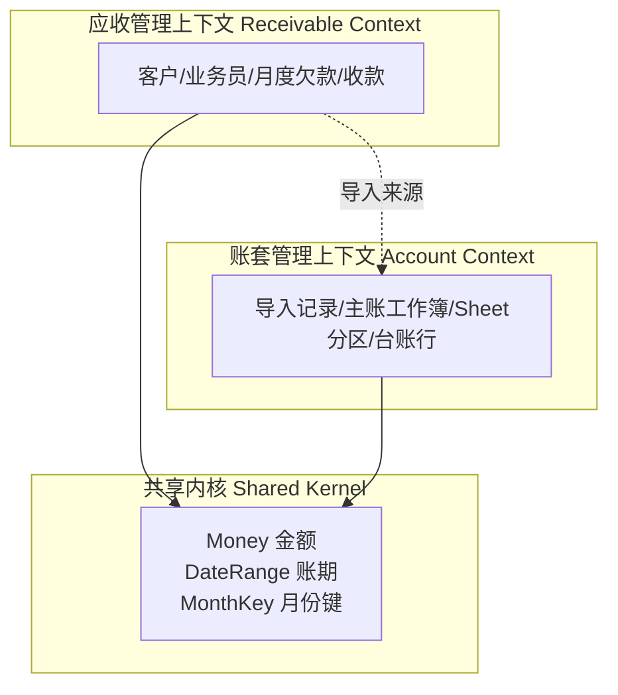
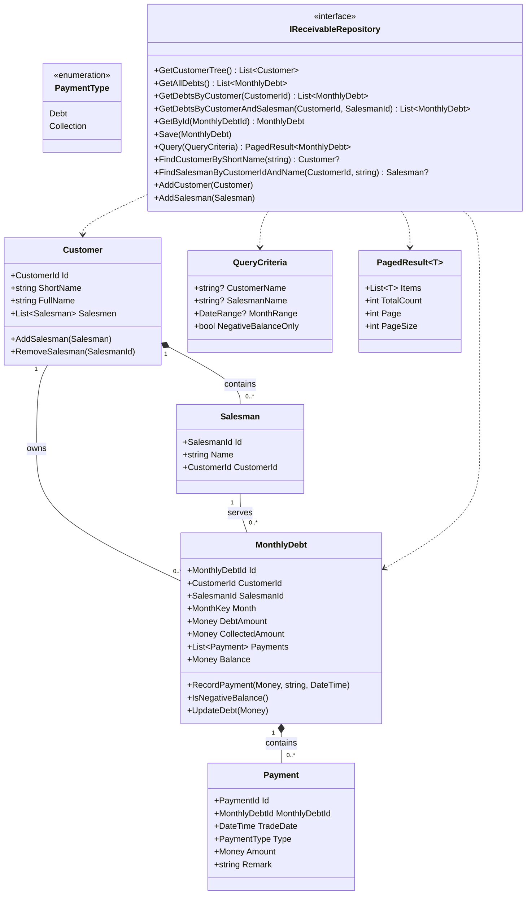
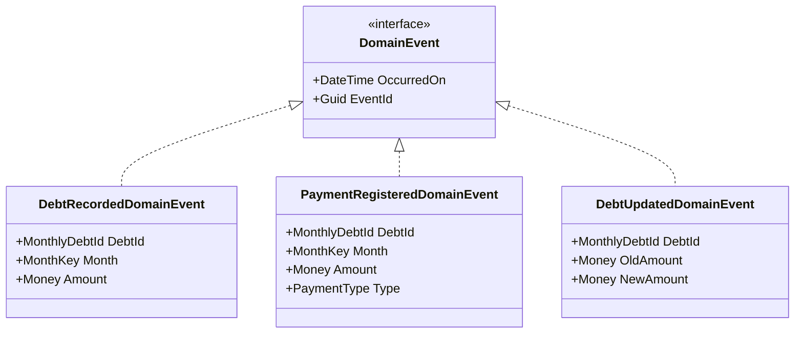
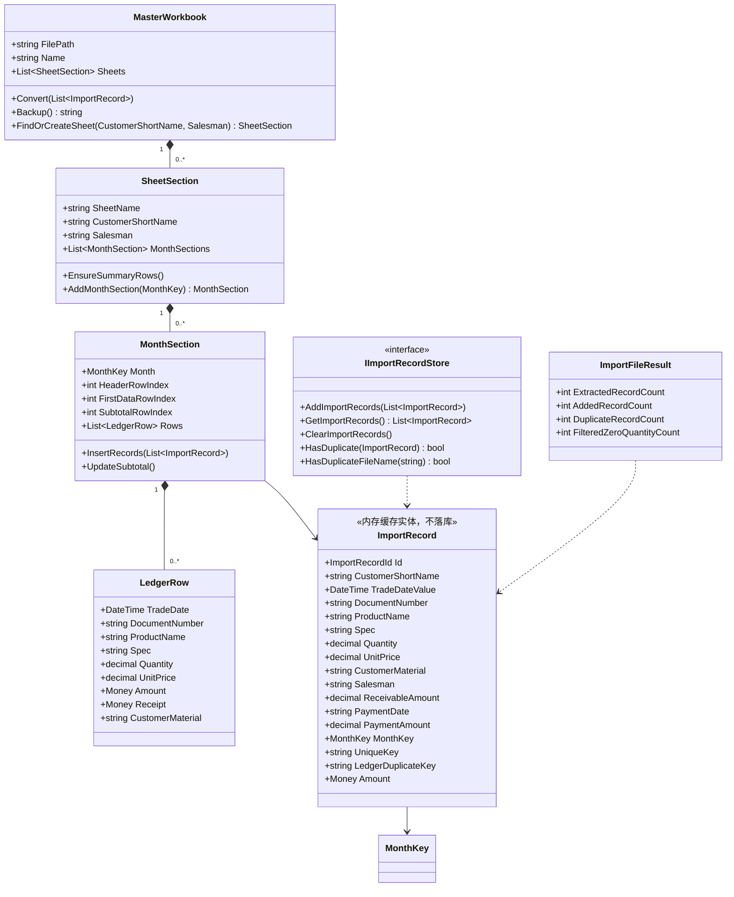
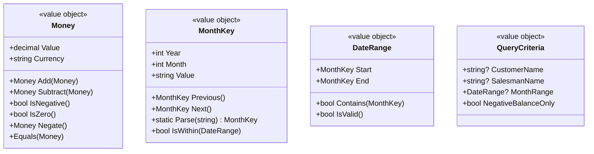
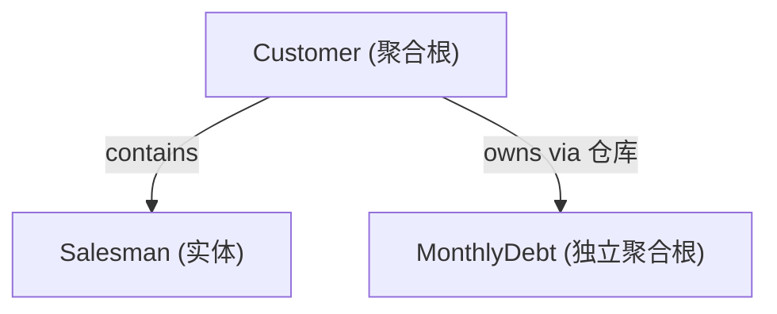
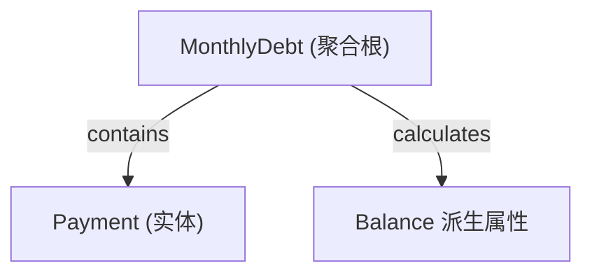
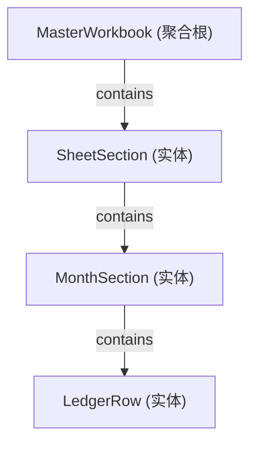

# Domain Model — PLErpTool (ERP 管理工具)

**Document Owner:** CTO — Dr. Kenji Nakamura (小T)
**Pipeline Stage:** 3 — UML Engineering Package
**Date:** 2026-08-08
**Status:** Draft — Pending User Approval

---

## 1. 限界上下文 (Bounded Contexts)

系统划分两个限界上下文 + 一个共享内核：

| 上下文 | 职责 | 聚合根 |
|---|---|---|
| 应收管理 (Receivable) | 客户树状检索、月度欠款、收款登记、差额查询、导出 | `MonthlyDebt`、`Customer` |
| 账套管理 (Account) | Excel 导入、主账分 Sheet 转换、模板复制、公式生成 | `MasterWorkbook` |
| 共享内核 (Shared Kernel) | 跨上下文复用的值对象 | — |

**上下文关系**：应收管理的导入源数据来自账套管理的 `ImportRecord`（客户简称+业务员维度），属 **客户/供应商关系**——应收上下文是账套数据的消费方。

---

## 2. UML 类图 — 应收管理上下文

### 领域事件

---

## 3. UML 类图 — 账套管理上下文

> ⚠️ **v2 调整**：`ImportRecord` 为**内存缓存实体**，不落库（见 ADR-005 v2）。其仓储接口 `IImportRecordStore` 由 Infrastructure 层内存实现，不依赖 EF Core。

---

## 4. 共享内核值对象

**值对象规则**：
- 不可变（`init` 属性）
- 相等性按值比较
- 无身份（无 Id）
- 工厂方法构造，校验内置于构造函数

---

## 5. 聚合设计说明

### 聚合 1：`Customer`（客户聚合）

- `Customer` 是聚合根，聚合内含 `Salesman` 列表
- `MonthlyDebt` 是独立聚合根（跨月独立变更），通过 `CustomerId`/`SalesmanId` 引用
- 跨聚合修改只经 `IReceivableRepository`，应用服务编排

### 聚合 2：`MonthlyDebt`（月度欠款聚合）

- `MonthlyDebt` 聚合根，内含 `Payment` 列表
- `Balance` = `DebtAmount` − `Σ Collection Payment.Amount`
- `RecordPayment()` 方法校验金额 > 0，追加 Payment，发布 `PaymentRegisteredDomainEvent`
- `IsNegativeBalance()` 支撑"当前差额为负"查询过滤

### 聚合 3：`MasterWorkbook`（主账工作簿聚合）

- `MasterWorkbook` 聚合根对应一个 Excel 文件
- `SheetSection` 对应一个客户+业务员的 Sheet
- `MonthSection` 对应 Sheet 内一个月度分区
- `LedgerRow` 对应明细行
- `Convert()` 编排导入记录写入，生成小计/合计公式

---

## 6. 实体与值对象判定

| 类型 | 名称 | 上下文 | 理由 |
|---|---|---|---|
| 聚合根 | `Customer` | Receivable | 有身份，聚合 Salesman，被树状检索引用 |
| 聚合根 | `MonthlyDebt` | Receivable | 有身份，聚合 Payment，月度独立变更 |
| 聚合根 | `MasterWorkbook` | Account | 有身份，对应文件，编排转换 |
| 实体 | `Salesman` | Receivable | 有身份，但无独立生命周期，属 Customer 聚合 |
| 实体 | `Payment` | Receivable | 有身份，但生命周期绑定 MonthlyDebt |
| 实体 | `SheetSection` | Account | 有身份，绑定 MasterWorkbook |
| 实体 | `MonthSection` | Account | 有身份，绑定 SheetSection |
| 实体 | `LedgerRow` | Account | 有身份，绑定 MonthSection |
| 实体 | `ImportRecord` | Account | 有身份，去重键 `UniqueKey`，**内存缓存，不落库** |
| 值对象 | `Money` | Shared | 不可变，按值相等 |
| 值对象 | `MonthKey` | Shared | 不可变，按值相等 |
| 值对象 | `DateRange` | Shared | 不可变，由两个 MonthKey 组成 |
| 值对象 | `QueryCriteria` | Receivable | 不可变查询参数 |

---

## 7. 领域服务

| 服务 | 上下文 | 职责 |
|---|---|---|
| `BalanceCalculator` | Receivable | 计算月度差额（跨聚合纯逻辑，无副作用） |
| `MasterDataSynchronizer` | Receivable | 转换时同步客户/业务员主数据（无则新增，有则不新增），建立 `(CustomerShortName, Salesman) → (CustomerId, SalesmanId)` 映射 |

> 领域服务仅当逻辑不属于任一实体/值对象、且涉及多聚合协作时才引入。`MasterDataSynchronizer` 编排客户与业务员聚合的查找/新建，输出主数据映射供转换与欠款写入使用。详见 `Business-Operations.md` §3.3。

---

## 8. 与 ExcelProject 现有概念映射

| ExcelProject (`Form1.cs`) | PLErpTool Domain | 迁移说明 |
|---|---|---|
| `ImportRecord` 类 | `ImportRecord` 实体 | 概念保留，`UniqueKey`/`MonthKey`/`LedgerDuplicateKey` 计算属性迁入 |
| `ImportFileResult` record | `ImportFileResult` 值对象 | 保留 |
| `SectionInfo` record | `MonthSection` 实体 | 概念保留，扩展为完整实体 |
| `SheetTemplates` record | `SheetTemplates`（Infrastructure） | 非领域概念，留基础设施层 |
| `FindSheetByCustomerAndSalesman` | `MasterWorkbook.FindOrCreateSheet` | 聚合根方法 |
| `CreateSheetFromTemplate` | `SheetSection` 工厂 + Infra `TemplateSheetBuilder` | 拆分领域/基础设施 |
| `InsertRecordsIntoSection` | `MonthSection.InsertRecords` | 聚合内方法 |
| `UpdateSubtotalRow` / `UpdateSheetSummary` | `MonthSection.UpdateSubtotal` + Infra | 公式生成为基础设施关注点 |

---

_本文档为 Stage 3 UML Engineering Package 的一部分。领域模型在用户批准后锁定，Stage 5 实现必须与之严格一致，任何偏差为 P1 缺陷（除非补提 ADR）。_