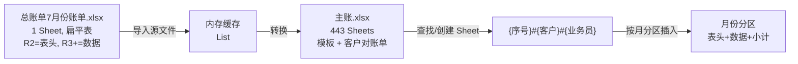

# Excel File Analysis — PLErpTool (ERP 管理工具)

**Document Owner:** CTO — Dr. Kenji Nakamura (小T)
**Pipeline Stage:** 3 — UML Engineering Package
**Date:** 2026-08-08
**Status:** Draft — Pending User Approval
**Source Files:** `docs/主账.xlsx`（911 KB, 443 Sheets）、`docs/总账单7月份账单.xlsx`（19 KB, 1 Sheet）

> 本文档基于 NPOI 实际读取两个真实 Excel 文件，记录其物理结构，作为账套转换/导入实现的基准参照。Stage 5 实现的 Excel 读写必须与此结构一致。

---

## 1. 总账单（源文件）— `总账单7月份账单.xlsx`

### 1.1 概况

| 项 | 值 |
|---|---|
| Sheet 数 | 1 |
| Sheet 名 | `Sheet1` |
| 行范围 | R0 – R2104（约 2100+ 行数据） |
| 列数 | 17 列（C0–C16） |

### 1.2 布局结构

```
R0:  佛山市泽敏塑料制品有限公司        ← 公司标题（跨列）
R1:  7月份对账单                       ← 副标题
R2:  表头行（17列）
R3–R2104: 数据行
```

### 1.3 表头映射（R2）

| 列索引 | 列名 | 对应 ImportRecord 字段 |
|---|---|---|
| C0 | 客户简称 | `CustomerShortName` |
| C1 | 交易日 | `TradeDateValue`（`yyyy-MM-dd`） |
| C2 | 单据号码 | `DocumentNumber` |
| C3 | 品名 | `ProductName` |
| C4 | 头+牙+锁+管长+大管+长心 | `Spec` |
| C5 | 数量 | `Quantity` |
| C6 | 单价 | `UnitPrice` |
| C7 | 应收金额 | `ReceivableAmount` |
| C8 | 收款日期 | `PaymentDate` |
| C9 | 收款金额 | `PaymentAmount` |
| C10 | （空） | — |
| C11 | 客户物料 | `CustomerMaterial` |
| C12–C13 | （空） | — |
| C14 | 业务员 | `Salesman` |
| C15 | 备注 | （可扩展 `Remark`） |
| C16 | （空） | — |

> **与 ExcelProject `RequiredHeaders` 对比**：ExcelProject 要求 9 个表头（客户简称/交易日/单据号码/品名/头+牙+锁+管长+大管+长心/数量/单价/客户物料/业务员）。总账单额外有 **应收金额/收款日期/收款金额** 3 列（ExcelProject 已支持 `GetOptionalCellText` 读取）。结构完全兼容。

### 1.4 数据样例（R3–R17）

```
纤佰丽 | 2026-07-07 | SA67070026 | 33光面牙外置ZG头 | 13980珠光绿401外置ZG头+... | 10070 | 0.68 | 6847.6 | (空) | 0 | (空) | 康华仕500ml... | (空) | (空) | 吴月红 | 450*22+170
广州博恩 | 2026-07-09 | SA67090016 | 33光面柳叶 | 黑色401柳叶头+... | 10050 | 0.5 | 5025 | (空) | 0 | (空) | (空) | (空) | (空) | 吴月红 | 400*24+450
广州芬帕 | 2026-07-03 | SA66270029 | 33扁 | 透明401扁+... | 60000 | 0.38 | 22800 | (空) | 0 | (空) | (空) | (空) | (空) | 吴家海 | 500*120
辉影 | 2026-07-04 | SA67040019 | 33AR牙K头 | 10990杏王401K头+... | 20095 | 0.9 | 18085.5 | (空) | 0 | (空) | (空) | (空) | (空) | 吴月红 | 400*50+95
```

### 1.5 日期格式

总账单日期为 `yyyy-MM-dd`（如 `2026-07-07`）。ExcelProject `TryParseTradeDate` 已支持此格式。

### 1.6 合并单元格

数据行有合并单元格：C9-C10（收款日期）、C11-C13（客户物料）、C15-C16（备注）跨列合并。导入时 NPOI 需正确读取合并区域首格的值。

---

## 2. 主账 — `主账.xlsx`

### 2.1 概况

| 项 | 值 |
|---|---|
| Sheet 数 | **443** |
| Sheet[0] | `模板`（模板 Sheet） |
| Sheet[1–442] | 客户对账单（每客户+业务员一个 Sheet） |

### 2.2 Sheet 命名规则

```
{序号}#{客户简称}#{业务员}
```

| 示例 | 解析 |
|---|---|
| `2#歌秀#吴月红` | 序号=2，客户=歌秀，业务员=吴月红 |
| `1#广州天源聚美包装有限公司#吴月红` | 序号=1，客户=广州天源聚美包装有限公司，业务员=吴月红 |
| `1#首品#` | 序号=1，客户=首品，**业务员为空** |

> ExcelProject `FindSheetByCustomerAndSalesman` 已用 `#` 分割 + `NormalizeSheetPart`（去空格）匹配，完全适配此命名规则。`GenerateSheetName` 用 `{序号}#{客户}#{业务员}` 格式，与现有一致。

### 2.3 模板 Sheet（Sheet[0] = "模板"）结构

```
R0:  泽敏塑料制品有限公司对账单          ← 标题（C0-C7 跨列合并）
R1:  （空行）
R2:  To：{客户名} | (空) | (空) | (空) | 时间：{日期}   ← 信息行（C4-C5、C6-C7 合并）
R3:  日期 | 送货单号 | 名称及规格 | (空) | 数量 | 单价 | 金额 | 收款 | 客户物料  ← 表头
R4+: 数据行（按月份分区，每个分区含表头+数据+小计）
R末: 合计 | ... | =SUM(各小计G列)
R末+1: 应付账款 | ... | =合计G列 - 合计H列
```

**模板 Sheet 特殊点**：包含多个月份分区（12月、1月、2月...），每月一个表头行 + 数据行 + 小计行。末尾有合计行和应付账款行。共 37 行（R0-R36）。

### 2.4 客户对账单 Sheet 结构（标准）

```
R0:  泽敏塑料制品有限公司对账单          ← 标题（C0-C7 合并，R0-R1 合并）
R1:  （合并到 R0）
R2:  To:  {客户名} | (空) | 业务员:  {业务员} | (空) | 时间:  {日期}  ← 信息行
R3:  日期 | 送货单号 | 名称及规格 | (空) | 数量 | 单价 | 金额 | 收款 | 客户物料  ← 表头（C8-C15 合并）
R4+: 数据行
R末-2: 小计 | (空) | (空) | (空) | =SUM(E列) | (空) | =SUM(G列) | =SUM(H列)
R末-1: 合计 | (空) | (空) | (空) | =SUM(小计E) | (空) | =SUM(小计G) | =SUM(小计H)
R末:   应付账款 | (合并) | (空) | (空) | (空) | (空) | (空) | =合计G - 合计H
```

### 2.5 列定义（客户 Sheet）

| 列索引 | 列名 | 公式/值 |
|---|---|---|
| C0 | 日期 | `yyyy/M/d` 字符串 |
| C1 | 送货单号 | 文本 |
| C2 | 名称及规格（品名） | 文本 |
| C3 | 规格（头+牙+锁+...） | 文本 |
| C4 | 数量 | 数值 |
| C5 | 单价 | 数值 |
| C6 | 金额 | `=F*E`（单价×数量）或 `=SUM(数据区)`（小计/合计） |
| C7 | 收款 | 数值或 `=SUM(H列)` |
| C8 | 客户物料 | 文本（C8-C15 合并） |

### 2.6 公式模式

| 行类型 | C4(数量) | C6(金额) | C7(收款) |
|---|---|---|---|
| 数据行 | 数值 | `=F{row}*E{row}` | 数值（通常 0） |
| 小计行 | `=SUM(E首:E末)` | `=SUM(G首:G末)` | `=SUM(H首:H末)` |
| 合计行 | `=SUM(各小计E)` | `=SUM(各小计G)` | `=SUM(各小计H)` |
| 应付账款行 | — | — | `=合计G - 合计H` |

> ExcelProject `UpdateSubtotalRow` / `UpdateSheetSummary` / `BuildSumFormula` / `BuildMultiCellSumFormula` 完全适配此公式模式。

### 2.7 合并单元格模式

| 区域 | 说明 |
|---|---|
| R0-R1, C0-C7 | 标题跨行跨列 |
| R2, C4-C5 | "时间"标签合并 |
| R2, C6-C7 | 日期值合并 |
| 数据行 C8-C15 | 客户物料跨列 |
| 小计/合计/应付行 C1-C5 | 标签区合并 |
| 小计/合计/应付行 C8-C15 | 物料区合并 |

> ExcelProject `CopyMergedRegionsForRow` / `CopyMergedRegionsForRange` 已处理合并区域复制。

### 2.8 列宽

| 列 | 宽度（1/256 字符） | 约字符数 |
|---|---|---|
| C0–C2 | 4437 | ~17 |
| C3 | 6869 | ~26（规格列，更宽） |
| C4–C7 | 4437 | ~17 |
| C8–C15 | 2154 | ~8（物料列，较窄） |

---

## 3. 两文件的关系



| 维度 | 总账单（源） | 主账（目标） |
|---|---|---|
| 结构 | 单 Sheet 扁平表 | 多 Sheet（1 模板 + N 客户） |
| 列 | 17 列（含应收/收款/备注） | 9 列（日期/单号/品名/规格/数量/单价/金额/收款/物料） |
| 日期格式 | `yyyy-MM-dd` | `yyyy/M/d` |
| 分组 | 无（全部平铺） | 按 `客户+业务员` 分 Sheet，按月分区 |
| 公式 | 无 | 金额=`单价×数量`，小计/合计/应付账款用 SUM |
| 合并单元格 | 数据行 C9-C10/C11-C13/C15-C16 | 标题/表头/物料/小计行跨列 |

---

## 4. 与 ExcelProject 实现的兼容性验证

| ExcelProject 能力 | 总账单适配 | 主账适配 |
|---|---|---|
| `FindHeaderRowIndex`（自动定位表头） | ✅ R2 匹配 9 必需表头 | N/A（主账不是导入源） |
| `BuildHeaderMap`（列映射） | ✅ C0-C14 映射正确 | N/A |
| `NormalizeHeaderAlias`（别名） | 总账单无别名需求 | N/A |
| `TryParseTradeDate`（日期解析） | ✅ 支持 `yyyy-MM-dd` | ✅ 写出用 `yyyy/M/d` |
| `TryCreateRecord`（行转记录） | ✅ 含应收/收款可选列 | N/A |
| `FindSheetByCustomerAndSalesman` | N/A | ✅ `#` 分割匹配 |
| `CreateSheetFromTemplate` | N/A | ✅ 复制模板前 3 行 + 摘要行 |
| `InsertRecordsIntoSection` | N/A | ✅ ShiftRows + 写行 |
| `UpdateSubtotalRow` / `UpdateSheetSummary` | N/A | ✅ SUM 公式生成 |
| `CopyMergedRegionsForRow` | N/A | ✅ 合并区域复制 |

**结论**：ExcelProject 现有逻辑与真实文件完全兼容，迁移到 PLErpTool 无需修改核心算法。

---

## 5. 导入流程的表头匹配策略

基于总账单真实结构，导入时表头匹配策略：

| 步骤 | 操作 |
|---|---|
| 1 | `FindHeaderRowIndex`：从 R0 开始逐行扫描，找到包含全部 9 个必需表头的行（总账单为 R2） |
| 2 | `BuildHeaderMap`：建立 `表头名 → 列索引` 映射 |
| 3 | 从 R3 开始逐行读取数据 |
| 4 | 空行跳过；汇总行（含"合计"/"月合计"）跳过 |
| 5 | 数量为 0 的行过滤（`FilteredZeroQuantityCount`） |
| 6 | `UniqueKey` 去重（客户+日期+单号+品名+规格+单价+物料） |

---

_本文档为 Stage 3 UML Engineering Package 的 Excel 结构分析，用户批准后锁定。Stage 5 实现的 Excel 读写必须与此结构一致。_

---

**Drafted by:** CTO — Dr. Kenji Nakamura (小T)
**Locked at Stage 3 gate approval — not revisable in Stage 4+.**