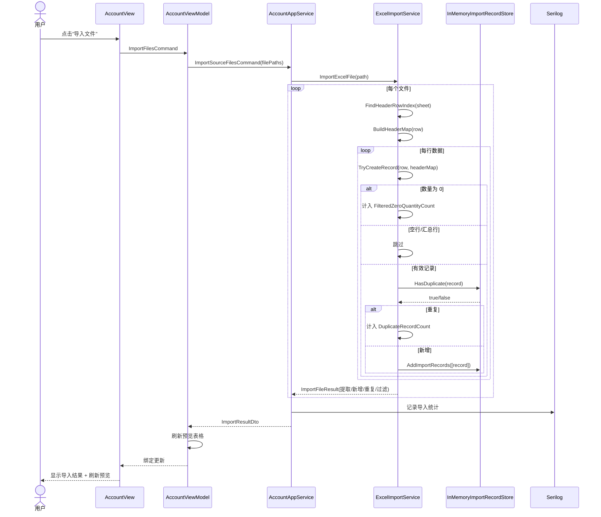
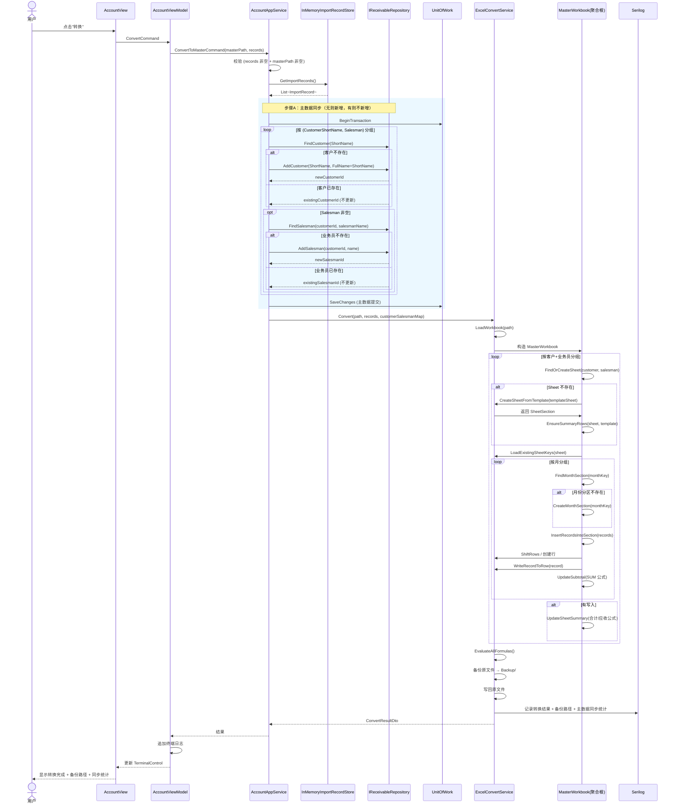
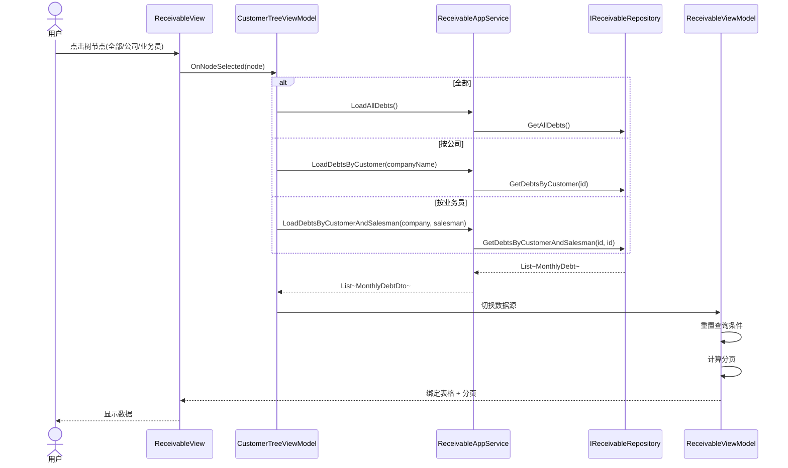
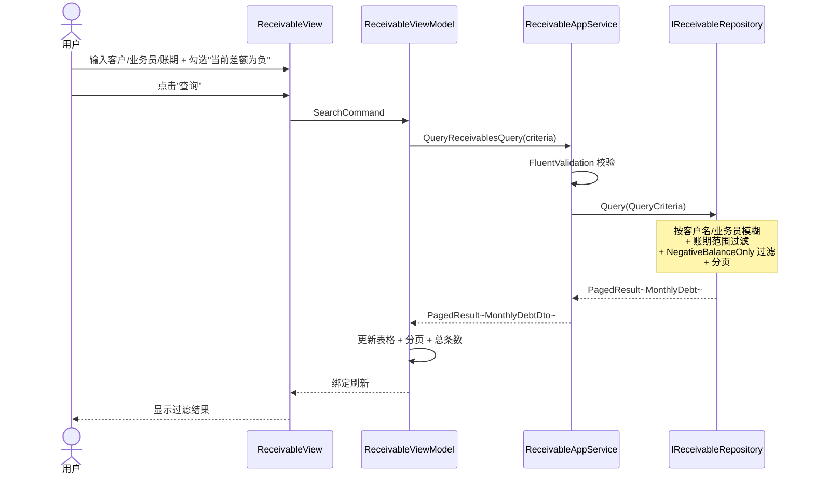
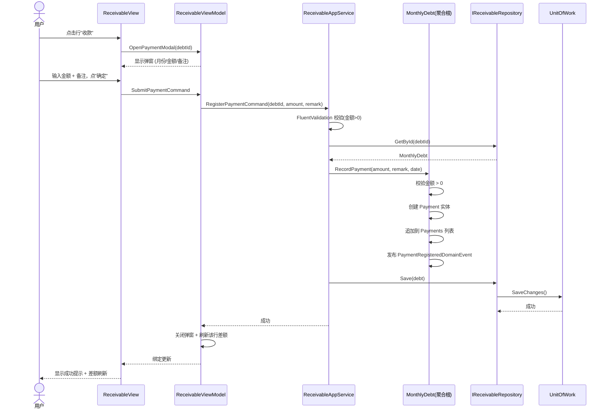
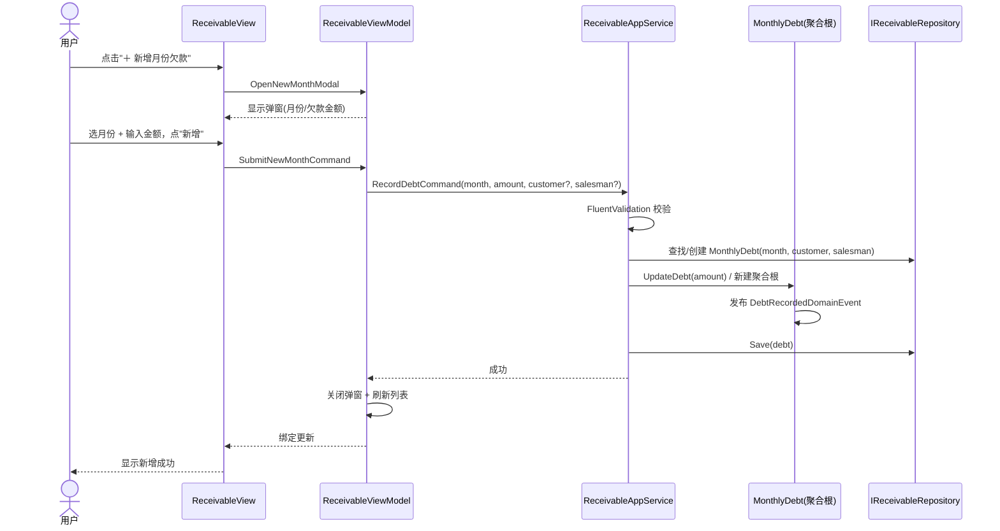
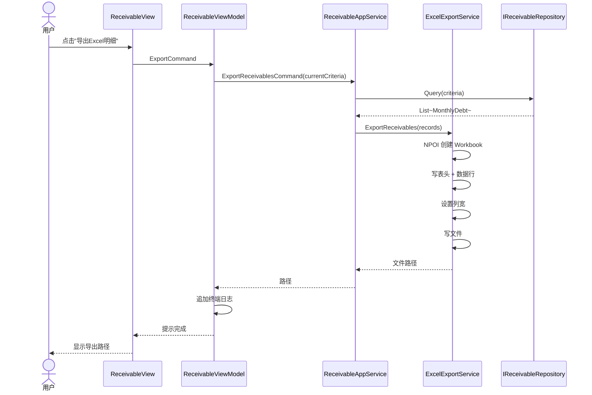
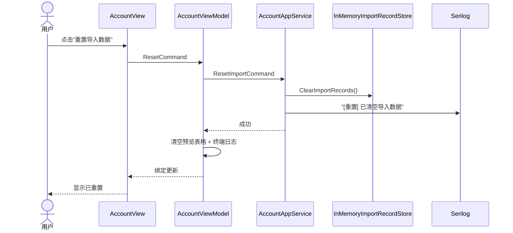
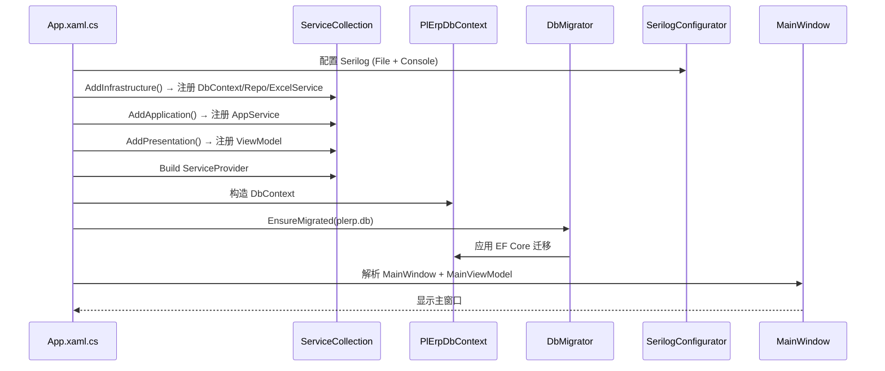

# Key Flows — PLErpTool (ERP 管理工具)

**Document Owner:** CTO — Dr. Kenji Nakamura (小T)
**Pipeline Stage:** 3 — UML Engineering Package
**Date:** 2026-08-08
**Status:** Draft — Pending User Approval

本文件以 UML 时序图描述系统关键业务流程，至少覆盖每个核心用例一个 happy path。

---

## 流程 1：账套导入源文件

**触发**：用户在账套管理界面点击"导入文件"按钮，多选 Excel 文件。
**来源**：ExcelProject `ImportBtn_Click`。

---

## 流程 2：账套转换写入主账（含主数据同步）

**触发**：用户点击"转换"按钮，将导入数据写入主账 Excel，并同步客户/业务员主数据。
**来源**：ExcelProject `CoverBtn_Click` / `AppendResultToMasterWorkbook` + 主数据同步（详见 `Business-Operations.md` §3）。

---

## 流程 3：应收管理 — 树状检索与数据加载

**触发**：用户在左侧客户树点击节点（全部/公司/业务员）。
**来源**：HTML 原型 `loadAllData` / `loadCompanyData` / `loadData`。

---

## 流程 4：应收管理 — 综合查询（含"当前差额为负"）

**触发**：用户在工具栏输入条件并点"查询"。
**来源**：HTML 原型 `searchData()`。

---

## 流程 5：应收管理 — 登记收款（弹窗）

**触发**：用户在表格行点击"收款"操作，弹窗录入金额。
**来源**：HTML 原型 `openRowActionModal` / `submitRowAction`。

---

## 流程 6：应收管理 — 新增月份欠款

**触发**：用户点击"＋ 新增月份欠款"，弹窗录入月份+金额。
**来源**：HTML 原型 `openNewMonthModal` / `submitNewMonth`。

---

## 流程 7：应收管理 — 导出 Excel 明细

**触发**：用户点击"导出Excel明细"。
**来源**：HTML 原型 `exportExcel()` + ExcelProject `ExportFailedRecords` 模式。

---

## 流程 8：账套管理 — 重置导入数据

**触发**：用户点击"重置导入数据"。
**来源**：ExcelProject `ResetBtn_Click`。

---

## 流程 9：应用启动与 DI 装配

**触发**：程序启动。对应 `App.xaml.cs` 组合根。

---

_本文档为 Stage 3 UML Engineering Package 的一部分。时序图在用户批准后锁定，Stage 5 实现必须覆盖所有列出的流程。_